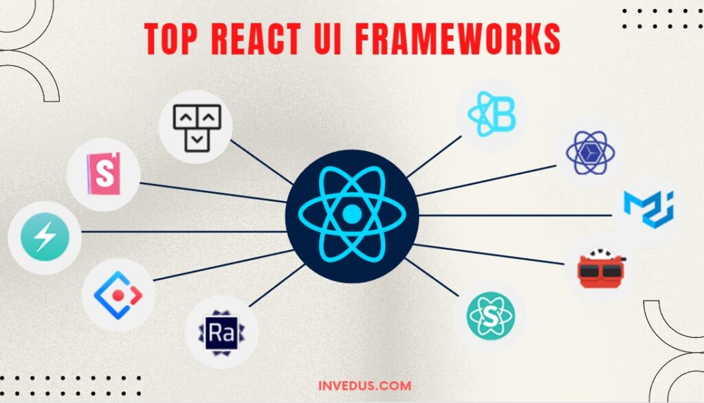

*The Value of UI Frameworks: A Closer Look at Bootstrap 5 and Semantic UI.*

Based on my experience using User Interface frameworks, I see it has become an integral tool in the world of web developers. These frameworks, like Bootstrap 5 and Semantic UI, offer pre-designed and reusable components, styles, and layouts that simplify the process of building aesthetically pleasing and responsive web interfaces. However, I argue that UI frameworks are very complex and time-consuming to learn, questioning their value compared to using raw HTML and CSS. 

## The Complexity of UI Frameworks

It is true that UI frameworks can be initially intimidating, particularly for beginners. They introduce a new set of rules, classes, and conventions that developers need to grasp. However, the complexity of UI frameworks is outweighed by the benefits they offer. During my experience, I love how I am able to offer pre-designed components and templates. Which saves considerable time and effort. Without a framework, I would have to reinvent the wheel with every project, leading to inconsistency and potential errors. Building responsive web designs that work seamlessly across various devices and screen sizes is very challenging to me. UI frameworks like Bootstrap 5 come with built-in responsive grids and components, ensuring a consistent user experience across platforms.

## Bootstrap 5: Is it Difficult to Learn?

Bootstrap 5 is one of the most popular UI frameworks available today. While it does have a learning curve, it's not overly difficult to master, especially for those with some experience in web development. However unfortunately, I do lack the experience of bootstrap and I did have a difficult time. Learning bootstrap was a huge benefit for me however! Bootstrap 5 offers comprehensive documentation that guides through its features, components, and best practices. I really enjoyed its customizable styles. Bootstrap's grid system simplifies the creation of responsive layouts, making it accessible for developers of varying skill levels. Bootstrap 5 does have many complexities of features. For beginners like me, this extensive set of tools can seem overwhelming. Overall, despite these potential challenges, learning Bootstrap 5 provides many advantages, such as saving time, improving development efficiency, and ensuring cross-browser compatibility. Once you invest the time to learn Bootstrap, you can leverage these benefits to streamline your web development projects!

## Semantic UI: An Alternative Perspective

Semantic UI is another UI framework worth exploring. It focuses on providing clear and human-friendly HTML structures, which can make the code more intuitive and readable. I do enjoy its easy theming and customization, giving developers more control over the design. I do like how the package behind Semantic UI is well-organized. I did face little challenges while installing the solution, but it is worth it when you see the results on the screen. 

## Conclusion

In conclusion, UI frameworks like Bootstrap 5 and Semantic UI offer substantial benefits that justify the investment of time and effort required to learn them. While they do introduce a learning curve, the efficiency, consistency, responsiveness, and community support they provide make them indispensable tools for web developers. The choice between Bootstrap 5 and Semantic UI ultimately depends on project requirements and personal preferences, but both can significantly enhance the quality and efficiency of web development. Ultimately, UI frameworks are not just about saving time and frustration but also about improving the overall quality, maintainability, and scalability of web applications. As the web development landscape continues to evolve, learning and mastering UI frameworks will remain a valuable skill for any software engineer or web developer.
